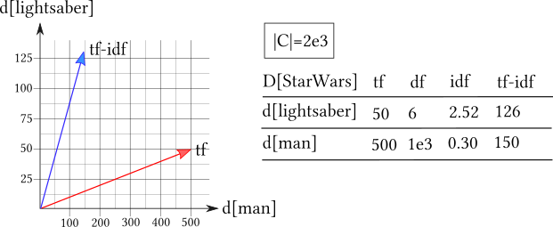
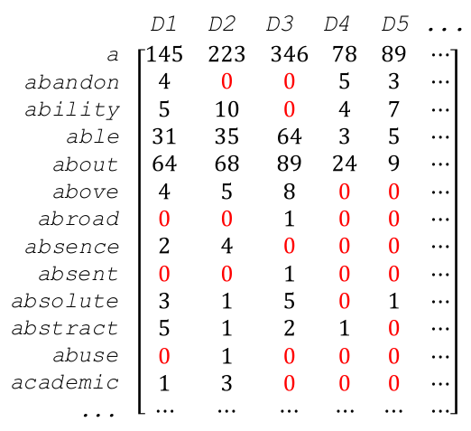

A quick overview of document-to-vector models for intelligent vector space retrieval
====================================================================================

Introduction
------------

The performance of a text retrieval system is highly dependent on the quality of the internal document representations. Those document representations are generated from the document's text by a so-called embedding algorithm, which "embeds" the documents as points into a space with a particular fixed dimensionality. This space is also called a latent semantic space, because its dimensions are *potentially/latently* representing particular semantic concepts.

There are four main properties to the latent semantic space that may be produced by an embedding algorithm:

1. Online (incremental) improvement capability

If the document corpus that is encoded by the embedding model changes frequently, it is important that you can gradually adapt your model to it. Especially for some of the more traditional semantic approaches, LSA in particular, the model is completely invalidated if the corpus changes, and therefore it coul not be improved upon incrementally.

2. Capability to capture information from word order

Some of the models assume that word order does not strongly influence the overarching semantics of a document. Intuitively though, grammar is obviously necessary for natural language understanding. Therefore, the models that ignore word order tend to capture only very superficial semantics, if any.

3. Sparsity of the latent coordinates

A perfect semantic vector space would contain only those dimensions that are completely perpendicular to each other. Those dimensions are also called the "basis vectors" of the latent semantic space. If the space contains more dimensions than it has linearily independent basis vectors, the points in this space are going to be artificially "spread out". This problem usually expresses itself in a large amount of zero coordinates contained in the semantic vectors.

4. Syntactic/Semantic character of latent dimensions

Different search use-cases require different document representations. Two such use-cases that are highly divergent representation-wise are, for example, recommendation search and boolean retrieval. The latter use-case requires the representation to contain terms discretely and deterministically in order to be able to evaluate contains(document, term) boolean queries. On the other hand, recommendations are (mostly) not guided by explicit conditions, and require a deeper, abstract understanding of the document to be encoded by the latent dimensions.

With the establishment of these four dimensions of comparison, let me present six models in the chronology of their development.

The (TF-IDF weighted) Bag-of-Words Model
----------------------------------------

The bag-of-words document encoding is based on a frequency distribution over the top 5k-50k words of the corpus language over a document. Each dimension of the embedded vector represents a certain term T, and the coordinate represents the number of occurences (frequency) f(D,T) of the term T in the document D.

One very important improvement of this extremely high-dimensional representation is a weighting scheme called "tf-idf". In this case, "tf" refers to "term frequency" and "idf" refers to "inverse document frequency". The document frequency df(T) of a term is the number of documents in which the term T occurs (not the number of occurences!). This metric allows for the definiton of the idf weight factor as log(N/df(T)). The goal of the idf weight is to "punish" the frequency of terms which occur in every or most documents (and therefore carry no distinct information), and "elevate" the terms which only occur in one or a few documents.

The effect of tf-idf is illustrated in this figure:

The most important advantage of tf-idf is it's extreme effectivity compared to the relatively low effort required for it's implementation. The encoding behavior of course is almost purely syntactic, although the idf weight introduces a semantic weight.

One drawback of this approach is the extreme sparsity of the embedding space, with at least 5k, but more typically 10k or even 30k dimensions. Another very obvious drawback is the complete disregard of word order assumed by the model.

LSA/I (Latent Semantic Analysis/Indexing)
-----------------------------------------

A popular method to reduce a vector space to it's basis spanning vectors is the application of Gaussian eleminiation, also called "row reduction". In order to be able to apply row reduction to a document space, first all document vectors are combined into a matrix, where each document vector is one column:

LSA employs a slighly more sophisticated, fuzzy version of Gaussian elimination called "Singular Value Decomposition" (SVD). This method was first introduced by Deerwester in 1990, and gained a lot of traction for its mathematically motivated approach to create a densely populated latent semantic space.

The most important drawback of LSA is the extreme computational effort behind SVD. The computational complexity of this algorithm is O(n^2*k^3), where n is the number of documents plus the number of terms, and k is the number of embedded latent dimensions. This is especially unfortunate considering that any changes to n will trigger a reexecution of the SVD algorithm.

LDA (Latent Dirichlet Allocation)
---------------------------------

Dirichlet is synonym for topic. Latent Dirichlet (Topic) Allocation is an algorithm established by by David Blei, Andrew Ng, and Michael I. Jordan in 2003. It is essentially a probabalistic clustering method, which tries to associate terms T with dirichlets (topics) D by calculating the posterior probability \$$p(t|d)$$ for each t in T and d in D. The optimization goal is for each dirichlet to be as unique as possible in it's posterior term probabilities.

The vector of posterior probabilities of a document Q to have a particular topic D, \$$p(Q|D)$$, can then be used to embed the document into a latent space. This space will be densely populated and encode reasonable semantic abstractions, such as DOG_related and CAT_related. However, due to the model's focus on words, the abstractions stay in the realm of "topics", which are superficial by nature. Non-topical characteristics, such as attitude or style of writing, which would be necessary for a truely insightful encoding, remain too subtle to be captured.

(TF-IDF weighted) Bag-Of-Embeddings
-----------------------------------

In 2013, Mikolov presented a novel apprach to encode terms: The Word2Vec system. A Neural Network autoencoder was put to the task of embedding terms into a latent space by predicting the term's context from the latent space (or vice versa). Starting with this work, embedded word vectors slowly started to replace one-hot vectors as the standard term representation.

The latent embedding space produced by the Word2Vec system tends to be of such high quality regarding it's semantic encoding behavior and the density of the resulting vector space, that the idea of using it to represent higher-order objects like sentences, paragraphs or even full documents seems reasonable.

This leads to a vector representation of documents as a tf-idf weighted sum over the embedding vectors of all terms in the document. However, this approach is still based on the assumption that word order does not influence meaning in a considerable way. This assumption is obviously still flawed as much is it was in the 1950's. However, the simplicity and performance behind this approach makes weighted word embedding sums a respectable document embedding technique.

Word-Sentence-Paragraph-Document HAN (Hierarchical Attention Network)
---------------------------------------------------------------------

Following the impressive work that was done as part of the Word2Vec system, Mikolov's team turned their attention (pun not intended) to the embedding of sentences, paragraphs and documents. They delivered in 2014 with a paper titled "Distributed Representations of Sentences and Documents". 

This was enabled by the slow rise of recurrent neural networks (RNN). Especially the Long-Short-Term-Memory (LSTM) and Gated Recurrent Unit (GRU) variants of RNN have gained enormous relevance. RNN are ideally suited to process chains of input data such as sequences of words, sentences and paragraphs. The underlying axiom of the Hierarchical Attention Network (HAN) is the idea, that every syntactic level is best encoded in its own embedding space. RNN are used to embed and encode each semantic level, and then produce a fixed-length summary vector via a so-called hidden "attention" layer. This recursive bottom-up process yields the document vector as its final root output:

(Image from https://richliao.github.io/images/HierachicalAttention.png)

HAN are very impressive in their ability to extract meaningful semantic dimensions, such as sentiment, from text documents. One drawback of HAN is their slightly complicated architecture, which makes them harder to implement and test.

(Variational) Sequence-To-Sequence Autoencoder
----------------------------------------------

Stacked RNN encoder-decoder architectures have slowly started to rival HAN in the state-of-the-art for document embedding. RNN encoder-decoder models have mostly been researched in relation to Neural Machine Translation: An encoding RNN outputs a so-called "thought vector" as it's final state. This thought vector then serves as the initial input to a decoder RNN. Backpropagation of error is performed over the outputs over the decoder back into the encoder.

(Image from https://camo.githubusercontent.com)

By setting Source Language = Target Language, these sequence encoder-decoder ("Seq2Seq") models become recurrent autoencoders. The "thought vector", which is the output of the encoder, does then serve as the embedded document representation. Compared to HAN, this technique is a little bit simpler to implement, but less reliable to train, especially for very long sequences.

Conclusion
----------

HAN and Seq2Seq autoencoders are the current state-of-the-art models to generate document embeddings. However, Bag-Of-Embeddings models remain meaningful competitors. LSA/LDA on the other hand or losing importance with the emergence of more powerful Neural Network models, but LDA is still maintaining a use-case of being able to produce posterior probabilities for a term given a latent topic. We are excited to find out, how out own Seq2Seq autoencoder will perform as an intelligent retrieval vector space generator.
